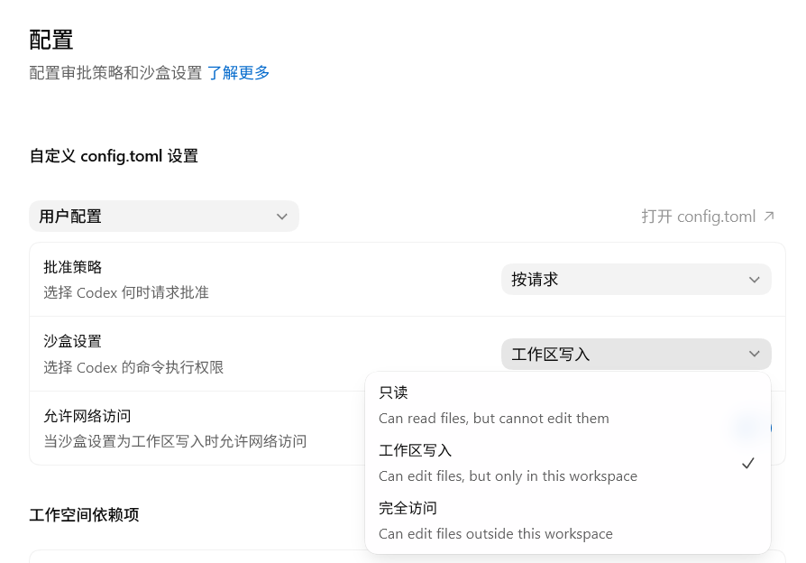
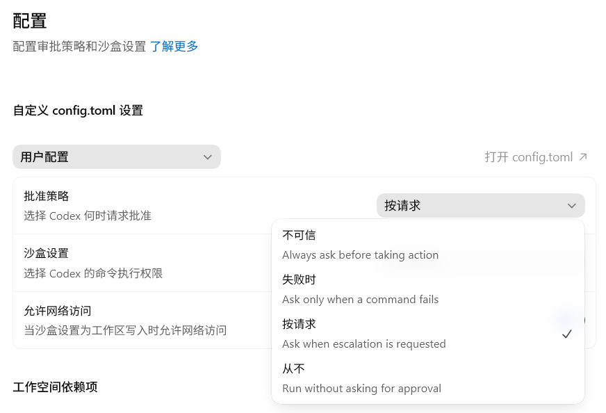

# 沙盒与审批：Codex 的安全护栏

Codex 能读取代码、修改文件、执行命令。这些操作需要受控边界：哪些目录可写、哪些命令可执行、什么情况下必须暂停并请求确认。

沙盒和审批就是这套边界。

对于绝大多数人而言，只需要把 `Auto-Reivew` 模式打开就够了。本文章旨在让你更好地理解 Codex 的沙盒机制和审批策略，同时补充一些进阶用法。

当你在利用沙盒和权限机制来约束 Codex 行为的时候，你已经在实践 `Harness Engineering `，即“约束工程” 。


::: tip 最后核对
官方资料最后核对日期：2026-06-18。本文依据 [Codex Sandboxing](https://developers.openai.com/codex/concepts/sandboxing)、[Agent approvals & security](https://developers.openai.com/codex/agent-approvals-security)、[Permissions](https://developers.openai.com/codex/permissions)、[Rules](https://developers.openai.com/codex/rules)、[Windows](https://developers.openai.com/codex/windows) 和 [Auto-review](https://developers.openai.com/codex/concepts/sandboxing/auto-review) 整理。
:::

## 三个概念

想象 Codex 在你的电脑里工作，就像在一个有玻璃墙和门禁的实验室里操作。

- **沙盒**就是实验室的墙和门禁：它规定 Codex 能碰哪些设备、能不能连外网、能不能写入项目外文件夹。墙内的常规操作，Codex 可以自己做；墙外的事情，需要先获得许可。
- **审批策略**就是门禁的触发规则：是「沙盒外区域每次请求确认」，还是「只在 Codex 越过沙盒边界时请求确认」，还是「完全不请求，自行处理」。
- **审批人**就是谁来回答门禁：你自己看门放行，还是让另一个智能门禁系统（Auto-review）先判断一下。

三者加在一起，决定 Codex 在你的电脑上到底能做什么、不能做什么。

## 默认推荐

Codex 启动时会根据目录状态自动推荐权限：

- 版本控制目录（带有.git文件夹）：`Auto`，也就是 `workspace-write + on-request`。
- 非版本控制目录（不带有.git文件夹）：`read-only`。
- 某些情况下，Codex 会先保持 `read-only`，直到你明确信任当前工作目录。

日常开发最常用的是
1. 沙盒设置：workspace write（工作区写入）
2. 批准机制：on-request（按请求）


**旧版写法（仍可用）：**

```text
sandbox_mode = "workspace-write"
approval_policy = "on-request"
approvals_reviewer = "user"
```

**新版 permission profiles 写法（beta）：**

```text
default_permissions = ":workspace"
approval_policy = "on-request"
approvals_reviewer = "user"
```

> **新旧配置不要混用。** 这些配置通常写在 `~/.codex/config.toml`。如果任意已加载配置里出现 `sandbox_mode`，或命令行传了 `--sandbox`，Codex 会使用旧版 sandbox 设置，而不是 `default_permissions`。

这段话什么意思？用上面的类比解释：

- Codex 可以在当前项目文件夹（workspace）里正常操作：读取文件、修改文件、运行常规的本地命令（比如 `git`、测试脚本、编译）。
- 如果需要联网、写到项目外面、或者做越界的事情，就会触发审批，暂停并请求确认。

这是官方推荐的默认设置。它不会每一步都要求交互确认，也不会让 Codex 获取整台电脑的权限。

## 沙盒模式

三种沙盒模式，对应不同的权限边界：

| 模式 | 对应英文 | 范围 | 审批触发条件 |
| --- | --- | --- | --- |
| 只读 | `read-only` / `:read-only` | 主要用于读文件和回答问题；命令执行也受只读边界限制 | 修改文件、执行需要写入的命令或联网时触发审批 |
| 工作区写入 | `workspace-write` / `:workspace` | 可以在项目里读、写、运行常规命令 | 联网或写到项目外时触发审批 |
| 完全访问 | `danger-full-access` / `:danger-full-access`| 没有沙盒限制，可以访问任何位置 | 取决于审批策略 |



**日常默认用工作区。** 它为 Codex 提供足够的操作空间完成普通开发任务，同时守住项目边界。

**不要轻易使用完全访问。** 它等于拆掉了所有沙盒限制，Codex 可以写入系统文件、访问任意网络。如果正在做删除数据、部署到生产环境或批量修改文件之类的操作，用完全访问会把风险放大。CLI 里的 `--dangerously-bypass-approvals-and-sandbox`（别名 `--yolo`）就是这个模式。

另外，即使在「工作区」模式下，下面这些路径也会被只读保护：

- `.git` 目录（你的版本控制数据）
- `.agents` 目录（你的 agents 配置）
- `.codex` 目录（Codex 自身的配置）

这些路径在默认 `workspace-write` 策略下是只读保护区。Codex 可以读取它们，但不能直接写入里面的内容。

## 审批策略

沙盒规定了边界，审批策略决定什么时候 Codex 必须暂停并请求确认。

| 策略 | 触发条件 | 说明 |
| --- | --- | --- |
| `untrusted`（不可信） | 命令不属于已知安全的读取操作 | 只自动执行已知安全的读操作；可能修改状态、触发外部执行路径或危险 Git 操作的命令都需要确认 |
| `on-failure`（失败时） | 命令执行失败时 | 先在当前权限下尝试执行；失败后再请求确认。这个选项在部分 App 配置界面中可见，但不是当前官方文档的默认推荐 |
| `on-request`（按请求） | 操作越过沙盒边界 | 默认推荐。沙盒内自动执行，越界时请求确认 |
| `never`（从不） | 不触发 | Codex 在既有权限内自行处理，不弹出审批 |



**`on-request`（按请求）是新手最友好的选择。** 沙盒内自动执行，越界时暂停并请求确认。不需要审批每一个文件修改，只需要在关键时刻把关。

**`never` 不是「自动变安全」。** 它只是不请求确认。安全取决于沙盒边界是否足够窄。比如 `read-only + never` 是安全的，因为 Codex 本来就不能改东西；但 `danger-full-access + never` 是官方标注的高风险组合——没有沙盒限制，也没人确认。


## Auto-review

如果一个命令需要越过沙盒，那么 Codex 就会发起请求。请求除了用户来批准以外，也可以使用 `Auto-review` 模式自动批准。

Auto-review 相当于：当 Codex 越过沙盒边界时，不是直接呈现给你，而是先交给 reviewer agent 判断。常见的有：

- 写入项目外目录
- 联网请求
- 请求更多权限
- 执行带副作用的 app 或 MCP 工具调用

**沙盒内允许的操作，不会经过 Auto-review。** 所以它不会改变日常操作的沙盒边界。

Auto-review 不会扩大沙盒边界。它不会扩展 Codex 的 workspace，不会自动给它网络权限，也不会让危险命令绕过沙盒。如果 reviewer agent 判断请求有风险，它会拒绝，Codex 需要选择更安全的替代方案，或者请求确认。

底层配置：

```toml
approval_policy = "on-request"
approvals_reviewer = "auto_review"
```

- `approval_policy` 决定什么时候产生审批请求。`on-request` 表示沙盒内操作继续执行，越过沙盒边界时才请求审批。
- `approvals_reviewer` 决定审批请求交给谁。默认是 `"user"`，即直接呈现给用户；改成 `"auto_review"` 后，符合条件的审批请求会先交给 reviewer agent。

这两个字段要一起理解。只写 `approvals_reviewer = "auto_review"` 不会让 Codex 主动产生更多审批请求；它只是改变已有审批请求的处理人。也就是说，Auto-review 的前提仍然是 `approval_policy` 处在会产生交互审批的模式，比如 `"on-request"` 或 `granular`。

如果你想保留沙盒边界，同时减少手动确认操作，可以这样写：

```toml
sandbox_mode = "workspace-write"
approval_policy = "on-request"
approvals_reviewer = "auto_review"
```

如果你已经改用新版 permission profiles，也可以这样写：

```toml
default_permissions = ":workspace"
approval_policy = "on-request"
approvals_reviewer = "auto_review"
```

更多阅读：[Agent approvals & security：Automatic approval reviews](https://developers.openai.com/codex/agent-approvals-security#run-without-approval-prompts)。

## 网络权限

联网能解决问题，也能引入风险。Codex 需要联网时，通常是为了：

- 安装依赖（`npm install`、`pip install`）
- 查询信息
- 调用 GitHub API
- 测试时访问本地服务器

但联网也会带来风险：

- **提示词注入**：恶意网页可能让 Codex 执行不该执行的命令
- **数据外发**：你的代码、密钥、`.env` 文件可能意外泄露
- **供应链风险**：安装的依赖本身可能不安全

所以：

- **如非必要，不要给网络权限。** 如果只是修改本地文档，完全不需要联网。
- **搜索资料时，优先用 Codex 内置的受控 web search**，而不是让 Codex 直接访问任意网页。
- **需要联网时，让 Codex 说明目标域名和用途，并且确认是访问可信任的网站。**
- **永远不要把 `.env`、token、cookie、私钥交给会联网的命令。**

## 进阶配置

如果你发现 Codex 经常因为沙盒边界过窄而频繁触发审批，推荐使用 Auto-review ，让 Codex 帮你审批，从而减少手动确认次数。

如果对项目安全边界要求很高，或者是处理一些敏感的操作，那么也有一些进阶配置可选：

**1. 扩展 workspace（最推荐）**

如果 Codex 需要同时修改两个项目目录，比如 `~/project-a` 和 `~/project-b`，你可以把第二个目录也加入可写范围。这是扩展 workspace，不是拆掉沙盒边界。

旧版写法：在 `config.toml` 的 `sandbox_workspace_write.writable_roots` 里添加。  
新版写法：在 `permissions.<name>.workspace_roots` 里添加。

旧版 sandbox 写法适合还在使用 `sandbox_mode` 的配置：

```toml
sandbox_mode = "workspace-write"
approval_policy = "on-request"

[sandbox_workspace_write]
writable_roots = ["~/project-a", "~/project-b"]
network_access = false
```

新版 permission profiles 写法适合把文件系统和网络边界放在同一个 profile 里。这里的 `my-docs-workspace` 是自定义 profile 名称，可根据需要命名。

```toml
default_permissions = "my-docs-workspace"
approval_policy = "on-request"

[permissions.my-docs-workspace]
extends = ":workspace"

[permissions.my-docs-workspace.workspace_roots]
"~/project-a" = true
"~/project-b" = true

[permissions.my-docs-workspace.filesystem.":workspace_roots"]
"." = "write"
"**/*.env" = "deny"

[permissions.my-docs-workspace.network]
enabled = false
```

这两个写法二选一。只要已加载配置里出现 `sandbox_mode`，Codex 就会走旧版 sandbox 设置，而不是 `default_permissions`。

**2. 为常用越界命令设置规则（rules）**

Rules 控制的是 Codex 需要在沙盒外运行命令时怎么处理。你可以在 `.rules` 文件里写 `prefix_rule`，把某类命令设为 `allow`、`prompt` 或 `forbidden`。规则里可以写 `match` 和 `not_match` 做验证，减少误匹配。

**3. 自定义 permission profiles（beta）**

如果你需要更细的控制——比如「能写代码，但只能访问 GitHub 和 npm，不能访问别的网站」——可以定义一个自定义 profile。也就是上文提及的`default_permissions`写法。

```toml
default_permissions = "workspace-net"
approval_policy = "on-request"

[permissions.workspace-net]
extends = ":workspace"

[permissions.workspace-net.filesystem.":workspace_roots"]
"." = "write"
"**/*.env" = "deny"

[permissions.workspace-net.network]
enabled = true

[permissions.workspace-net.network.domains]
"api.github.com" = "allow"
"registry.npmjs.org" = "allow"
"*.npmjs.org" = "allow"
```

网络权限一旦开启，最好配合域名规则。`"*"` 也可以放行公共网络，但它的范围很大，不适合当默认示例。

**4. 细粒度审批策略（granular，需手动配置）**

如果你只想对特定类型的审批请求分别控制，而不是全部越过沙盒边界的操作都请求确认，可以用 `granular` 策略。它不在 UI 下拉菜单里，需要手动在 `config.toml` 里写：

```toml
approval_policy = { granular = {
  sandbox_approval = true,   # 沙盒越界时问
  rules = true,              # rules 触发时问
  mcp_elicitations = true,   # MCP elicitation 请求时问
  request_permissions = false,  # 权限请求自动拒绝
  skill_approval = false     # skill 脚本审批自动拒绝
} }
```

这里的 `true` 表示该类请求保持交互审批；`false` 表示自动拒绝。它是 `on-request` 的进阶替代，不是 UI 选项。

更多详情请阅读：[Agent approvals & security：granular approval policy](https://developers.openai.com/codex/agent-approvals-security#run-without-approval-prompts)。


## 平台差异

不同系统的沙盒实现不同，但对你来说，用法是一样的：

- **macOS**：使用系统自带的 Seatbelt 机制，无需额外配置。
- **Windows**：原生 Windows 有两个版本。`elevated` 更强，使用独立低权限用户和防火墙；`unelevated` 是回退，使用当前用户的受限令牌。有些公司电脑的策略限制可能只能用 `unelevated`。IDE 里可以设置让 Codex 运行在 WSL2 里，这样用的是 Linux 的沙盒机制。
- **Linux / WSL2**：需要安装 `bubblewrap`。如果缺少它，Codex 可能会弹出警告或性能下降。WSL1 从 Codex 0.115 起不再支持。

遇到报错时，记住两点：先检查 Codex 的权限模式设置，再查询对应平台的文档。无需记忆实现细节。

## 高风险判断

以下情况，建议让 Codex 先说明计划，再决定是否放行：

- 删除文件、批量移动文件、清理目录
- 数据库迁移、修改生产数据
- 修改认证、权限、支付、账单相关代码
- 访问生产服务器或外部 API
- 处理密钥、token、cookie、私有凭据
- 大规模安装或升级依赖
- 执行部署、发布、推送 release

判断标准：

1. **有没有不可逆的副作用？**（删除后无法恢复）
2. **会不会涉及敏感数据？**（密钥、用户数据）
3. **会不会影响项目外面？**（生产环境、别的系统）

如果你不确定，可以在任务开头贴这段提示词，让 Codex 更谨慎：

```text
请在动手前先说明你计划运行的命令和可能影响的文件。不要读取 `.env`、密钥、token、cookie 或任何私有凭据。不要执行删除数据、发布、部署或迁移命令，除非我明确确认。
```

这段话不能代替沙盒，但能让 Codex 更早说明计划，减少误操作。

## 团队建议

- **统一配置标准**。团队内统一审批策略和沙盒模式。有人用 `never` + `danger-full-access`，有人用 `on-request` + `workspace-write`，发生问题时难以排查。把推荐的配置通知给团队成员，按统一标准执行。
- **配置进版本控制**。`.rules`、`AGENTS.md` 和 项目级 `config.toml` 文件纳入版本控制，克隆仓库后权限一致。
- **敏感数据隔离**。生产密钥不放在普通开发环境。用 profile 里的 `deny` 规则把 `**/*.env` 和 `~/.ssh` 标记为禁区，比依赖人记忆更可靠。
- **高风险操作强制审批**。对删除、部署、数据迁移等操作，用 `granular` 或 `rules` 强制走审批流程。
- **Codex 的改动仍然要 review**。沙盒和审批负责边界控制，不负责代码质量。代码改动仍然走正常的 PR 流程。
